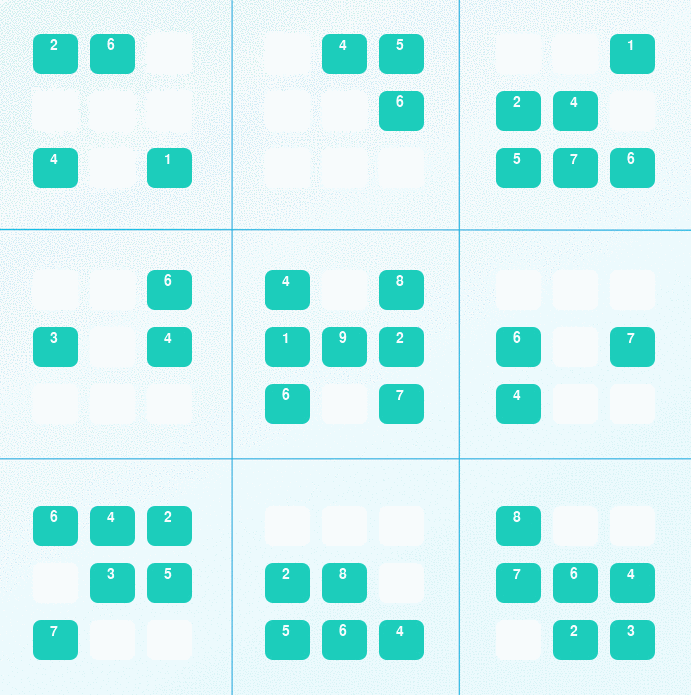

## sudokuAI

The introductory project to the [Artificial Intelligence Nanodegree program](https://classroom.udacity.com/nanodegrees/nd889/syllabus), designed to solve any Sudoku (diagonal or otherwise!) 

It can do this via **Constraint Propogation** and **Depth-First Search**, which allows to dramatically reduce and iteratively search thorugh solution space to find a solution to our sudoku. Naturally there are many smaller steps necessary to achieve this that are explored in the course, but the vast majority of them are explored in the [original approach by Peter Norvig](http://norvig.com/sudoku.html). 

### Setup

Please note that the *majority of this code is not mine*, it is a fork from [Udacity's repo](https://github.com/udacity/aind-sudoku) whose `solution.py` has been modified to include my own specific solution to this project. 

This project requires Python 3 (Preferably as distributed by [Anaconda](https://www.continuum.io/downloads)) and can be visaluzed via [Pygame](http://www.pygame.org/download.shtml) to get a visualization like the one above. 

After setting up, this project can be run via:

        python solution.py